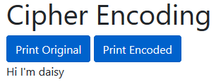
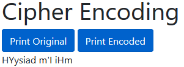

# _Simple Cipher_

#### _Exercise in Javascript Functions and String Methods, 01.13.2020_

#### By _**Tiffany Siu and Krista Rutz**_

## Description

This exercise is to practice writing functions in Javascript and using String methods to manipulate string input into an encoded sentence.  The program takes a sentence from user input and does a series of methods to encode it.  Then both the original and encoded sentence can be viewed.

## Setup/Installation Requirements

### Requirements to Run
* _Web Browser_

### Other Resources Used
* _JQuery_
* _Bootstrap_

### Instructions
_This page may be viewed by cloning the [repository](https://github.com/TSiu88/cipher.git) from my [GitHub page](https://github.com/TSiu88) and opening the **index.html** file in any web browser._

## Technologies Used

* _HTML_
* _CSS_
* _Javascript_
* _JQuery_
* _Bootstrap_
* _Markdown_

## Notable Features
<!-- _features that make project stand out_ -->

## Specifications

* _Prompt user to enter a sentence_
  * _Example Input: "how are you"_
  * _Example Output: sentence saved as variable_
* _First and last letter of sentence is capitalized and returned as a new string_
  * _Example Input: "how are you"_
  * _Example Output: "HU"_
* _The first and last letters from the previous step are reversed and added back to the original sentence_
  * _Example Input: "how are you" and "HU"_
  * _Example Output: "how are youUH"_
* _Count the number of letters in the original sentence and divide by two (rounded down), take the character at that position and add to the front of encrypted string_
  * _Example Input: "how are youUH"_
  * _Example Output: "rhow are youUH"_
* _Take the result of all previous steps and reverse the string_
  * _Example Input: "rhow are youUH"_
  * _Example Output: "HUuoy era wohr"_
* _Have two buttons to show either original or encrypted sentences_
  * _Example Input: click "Print Encoded"_
  * _Example Output: "HUuoy era wohr" shown, original sentence hidden_

## Screenshots

_Here is a snippet of what the original sentence looks like:_

_Here is a preview of what the output looks like:_

## Known Bugs

_There are currently no known bugs in this program_

## Support and contact details

_If there are any question or concerns please contact me at my [email](mailto:tsiu88@gmail.com). Thank you._

### License

*This software is licensed under the MIT license*

Copyright (c) 2020 **_Tiffany Siu, Krista Rutz_**
